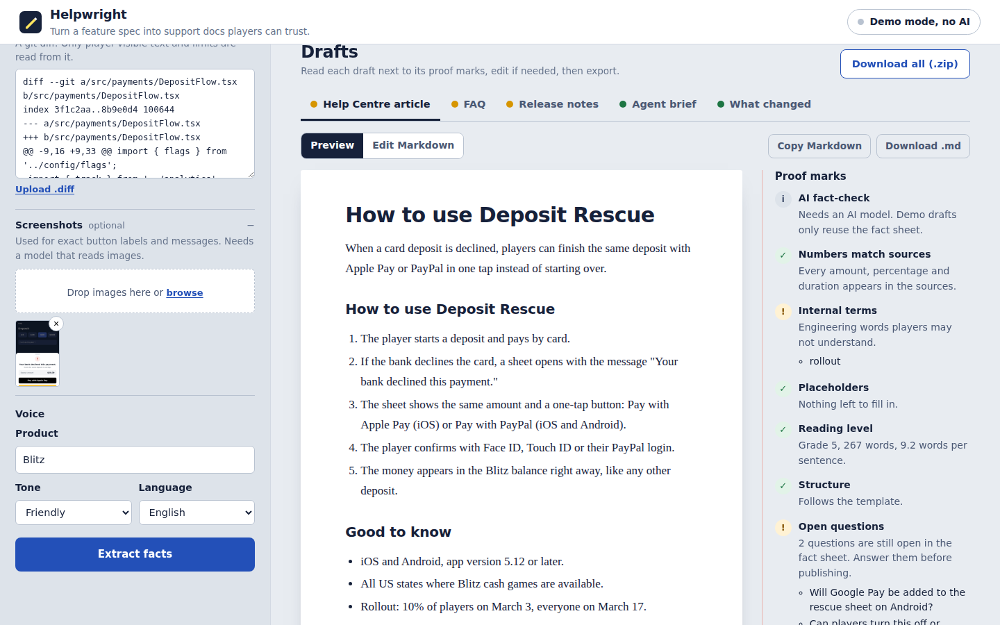
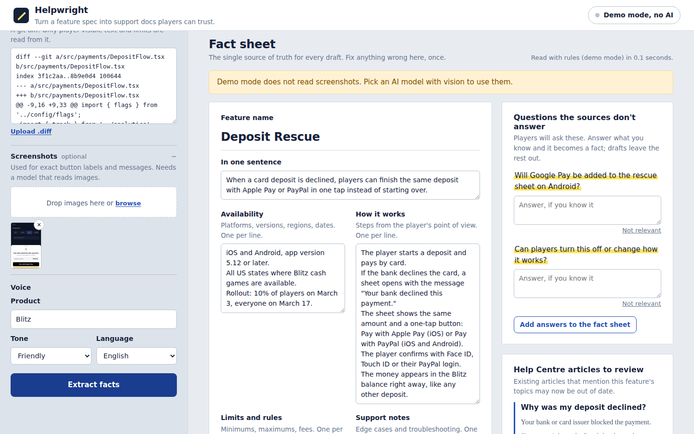
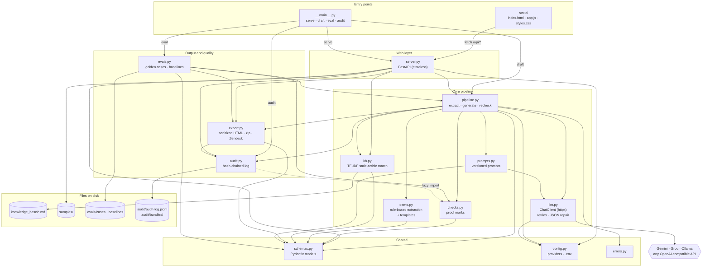
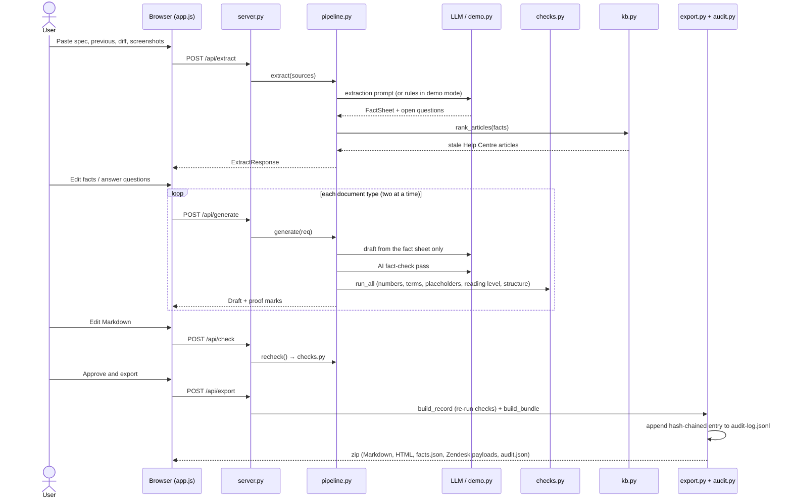

# Proofmark

**Turn a feature spec into customer-support documentation players can trust.**

Proofmark reads what product teams already write (a spec, its previous version, a code diff, screenshots) and drafts a Help Centre article, an FAQ, release notes, an internal agent brief and a "what changed" comparison.

It is built around one idea: support docs fail when they guess. So Proofmark extracts the facts first, shows you the questions the spec leaves open, writes every document from those facts only, and marks up each draft with checks you can verify before publishing.




## Quick start

Requires Python 3.10 or newer.

```bash
git clone https://github.com/laurentlaurent/proofmark.git
cd proofmark
python3 -m venv .venv
source .venv/bin/activate        # Windows: .venv\Scripts\activate
pip install -r requirements.txt
python -m proofmark             # opens http://127.0.0.1:8000
```

Click **Deposit Rescue (v2 vs v1)**, then **Extract facts**, then **Draft documents**.

No API key is needed to try it: without one, Proofmark runs in **demo mode** (rule-based extraction and templates) so the whole workflow can be clicked through in a minute. For real AI drafts, pick any free option:

| Option | Cost | Setup | Notes |
| --- | --- | --- | --- |
| Google Gemini | Free tier | Key from [AI Studio](https://aistudio.google.com/apikey), set `GEMINI_API_KEY` | `gemini-flash-latest`, reads screenshots |
| Groq | Free tier | Key from the [Groq console](https://console.groq.com/keys), set `GROQ_API_KEY` | `openai/gpt-oss-120b`, very fast, text only |
| Ollama | Free, local | Install [Ollama](https://ollama.com), run `ollama pull llama3.1` | Private. Use a vision model (e.g. `gemma3`) for screenshots |
| Anything else | Varies | `LLM_BASE_URL`, `LLM_MODEL`, `LLM_API_KEY` | Any OpenAI-compatible API: OpenRouter, LM Studio... |

Copy `.env.example` to `.env`, fill in one key and restart. You can also switch model from the **Model** button in the app; a key typed there stays in the browser tab and is only sent to your local server.

## How it works

1. **Sources.** Paste or upload the spec. Optionally add the previous version, a git diff and up to four screenshots.
2. **Fact sheet.** The model extracts a structured fact sheet: availability, steps, limits, support notes, exact on-screen text, changes, internal terms, and the **open questions** the sources don't answer. You can edit everything. Answer a question and it becomes a confirmed fact; leave it open and drafts stay silent on it. A side panel lists existing Help Centre articles this feature probably makes stale, with the sentence that matched.
3. **Drafts.** Each selected document is written from the fact sheet only, two at a time to respect free-tier rate limits, then fact-checked by a second AI pass. Every draft gets **proof marks** in its margin:
   - **AI fact-check:** statements the fact sheet does not support.
   - **Numbers match sources:** any amount, percentage or duration not found in the sources.
   - **Internal terms:** code names, ticket IDs and flags fail; engineering jargon warns (player-facing docs only).
   - **Placeholders:** TBD, `[link]`, `{{...}}`.
   - **Reading level:** Flesch-Kincaid grade, target 8 or below for player-facing docs.
   - **Structure:** what each document type needs (numbered steps, 5 to 8 questions, a 50-word store blurb...).
   - **Open questions** still unanswered.
4. **Review, sign off and export.** Edit the Markdown (checks re-run as you type) or redraft with a note such as "shorter, lead with the new limits". A reviewer then approves each draft by name; a draft with failing checks can only be approved with a note saying why, and editing or redrafting withdraws the approval. The export is a zip with Markdown, standalone HTML, `facts.json`, the sources, a check report, an audit record and Zendesk article payloads (created as unpublished drafts), and every export is written to the audit log.

| Document | Reader | Purpose |
| --- | --- | --- |
| Help Centre article | Players | Task-based article: steps, limits, troubleshooting |
| FAQ | Players | 5 to 8 questions in players' own words |
| Release notes | Players | Store blurb of 50 words or fewer, plus changelog bullets |
| Agent brief | Support agents | What changed, troubleshooting steps, ready-to-send replies, what is not confirmed yet |
| What changed | Support team | Before and after table, Help Centre articles to update |



### Command line (for CI)

```bash
python -m proofmark draft --spec spec.md --previous spec-v1.md --diff pr.diff --out docs-out/ --fail-on fail
```

Writes the drafts, `facts.json`, `check-report.md` and `audit.json`, and exits with code 1 when a check fails, so it can run on a release pull request. Run `python -m proofmark draft --help` for all options.

## Audit trail

Every export records what left Proofmark, what it was based on, how it was checked and who approved it:

- **In the zip:** `audit.json` holds hashes of the sources and the fact sheet, the model and prompt version behind the fact sheet and each draft, whether a draft was edited by hand, the checks re-run on the final text, and each approval (who, when, note). The sources themselves are included under `sources/`.
- **On disk:** each export is appended to `audit/audit-log.jsonl`, with a copy of the zip in `audit/bundles/`. Every entry includes the hash of the previous one, so edited, deleted or reordered history is detectable.

```bash
python -m proofmark audit            # list recorded exports and approvals
python -m proofmark audit --verify   # check the hash chain and the stored zips
```

Checks are re-run on the exported text rather than trusted from the browser, and an approval only counts if the text is still exactly what the reviewer approved.

## Regression evaluation

`evals/cases/` holds golden cases: a spec, plus what a good result must and must not contain. Each case lists key facts for the fact sheet and each document, the internal terms to detect, the gaps that should become questions, the Help Centre articles that go stale, and forbidden text such as code names or unconfirmed features. Expectations accept alternatives ("7 days" or "seven days"), because models paraphrase.

```bash
python -m proofmark eval                    # score every case, compare with the baseline for this model
python -m proofmark eval --save-baseline    # accept the current scores as the new baseline
python -m proofmark eval --provider gemini --no-fact-check   # fewer calls on a free tier
```

It reports fact coverage, internal-term and gap recall, stale-article recall, leaks, failing checks, AI-flagged claims and reading grade, then exits with code 1 if any metric drops beyond its tolerance, or if forbidden text appears at all. Baselines are stored per model in `evals/baselines/`. The repo ships the demo-mode baseline, and CI runs the demo evaluation on every push. Save a baseline for your AI model before changing prompts, then re-run after the change.

## Key product decisions

1. **Facts first, documents second.** Instead of "prompt in, article out", the model first builds a fact sheet that a person can correct in one place. Every document is generated from it, so the five documents cannot contradict each other, and grounding becomes checkable because the fact sheet is the reference.
2. **Show the gaps instead of filling them.** The costliest failure in support documentation is a confident, wrong answer. A wrong deposit limit or an invented refund promise creates tickets, chargebacks and compliance risk. Proofmark asks the questions players will ask, highlights them, and keeps unanswered topics out of the drafts. It is designed to speed up a writer's review, not to publish on its own.
3. **Trust through visible, cheap checks.** Deterministic checks (numbers, code names, placeholders, reading level, structure) are instant, free, explainable and cannot hallucinate. The AI fact-check catches what rules cannot. Proof marks sit next to the text, like an editor's margin notes.
4. **Support agents are users too.** Besides player-facing docs, Proofmark writes an agent brief (troubleshooting steps, ready replies, what not to promise yet) and a "what changed" view, and it flags existing articles that go stale. Documentation debt is often the hidden cost of a release.
5. **Zero-friction evaluation.** It runs with no key at all (demo mode), then with a free key. Two realistic samples are built in; one of them, Deposit Rescue, follows the Part I finding that card deposits fail most often.

## Key technical decisions

- **FastAPI and vanilla JavaScript, no build step.** One `pip install`, one command. The server keeps no session state: the browser holds the working state and sends what each step needs. The only thing written to disk is the audit log, on export.
- **One OpenAI-compatible client for every provider** (`proofmark/llm.py`, built on httpx, no vendor SDK). Gemini, Groq, Ollama and most others expose the Chat Completions API, so switching model is a configuration change. The client handles what breaks on free tiers: 429s with `Retry-After`, 5xx retries, providers that reject JSON mode, JSON wrapped in prose or code fences (with one repair retry), `<think>` blocks from reasoning models, and clear messages for bad keys or model names.
- **Structured output with tolerant validation.** Pydantic models coerce messy model output (a string instead of a list, objects instead of strings, leftover bullets) instead of failing the whole run.
- **Prompts in one versioned file** (`prompts.py`; `PROMPT_VERSION` is stored in each draft's metadata). Source material is wrapped in `<source>` tags and declared to be data, a basic mitigation against prompt injection from pasted specs and diffs.
- **Deterministic backstops around the model.** Rules add code names, ticket IDs and feature flags the model missed, and numbers in the fact sheet are checked against the raw sources right after extraction.
- **Explainable article matching.** TF-IDF over a folder of Markdown articles (`knowledge_base/`), showing the shared terms and the matching sentence. No embedding service needed: drop exported Help Centre articles into the folder.
- **Model output is untrusted.** Rendered HTML goes through an allowlist sanitizer before it reaches the browser.
- **A tamper-evident audit trail without a database.** An append-only JSON Lines file where each entry hashes the previous one, plus the exported zips. It needs no service to run, it's easy to inspect, and `audit --verify` detects any change to history.
- **Regression evaluation as a quality gate.** Golden cases scored with transparent string matching instead of an AI judge, so the scores are cheap, deterministic in demo mode and easy to debug. Per-model baselines with tolerances absorb normal variation between AI runs.
- **Offline tests.** 51 tests, including the whole AI path against a fake OpenAI-compatible model (JSON-mode fallback, retries, JSON repair, screenshot routing, fact-check), audit tampering scenarios and the evaluation gate. CI runs them on Python 3.10 and 3.12, plus a CLI smoke test and the demo evaluation.

## Assumptions

- Users are support people and CX content writers, and ops people who publish Help Centre content. Readers are players  and support agents.
- Product teams write specs in Markdown or plain text (a PRD, a Jira epic, a release brief). Diffs and screenshots are optional extras.
- The Help Centre is English-first. Amounts are in US dollars.
- The samples (Deposit Rescue, Streak Shield) and the knowledge-base articles are fictional, written for this case study.
- We only use free tiers (Gemini, Groq) or local models (Ollama). No paid API is needed or used.

## Known limitations

- **Demo mode is basic.** It rearranges the spec with rules and templates and does not rewrite anything (steps stay in the spec's third person). Real drafts need a model.
- **Checks are heuristics.** The numbers check catches invented figures, not wrong words ("iOS only" when the feature is also on Android). The AI fact-check is a second opinion from a model, not a guarantee. Reading level uses an English formula, so other languages are not scored. The jargon list is generic.
- **Free-tier rate limits.** Drafting five documents with fact-checking takes about 11 model calls, which can hit per-minute limits on free tiers. The client waits and retries, but a full run can take a minute or two.
- **Data privacy.** Free tiers may use submitted data to improve their models; check each provider's terms. Use Ollama for confidential specs.
- **No sessions, accounts or collaboration.** Refreshing the page loses the work in progress, so export first.
- **Reviewer names are typed, not authenticated.** The audit trail records who approved what, but anyone can type any name, and someone with write access to the audit folder could rebuild the whole chain. Anchoring the latest hash somewhere else (a commit, a ticket, a log service) and signing in with the company's accounts would close both gaps.
- **Article matching is lexical** and reads a local folder, not the live Help Centre. It misses synonyms.
- **Prompt injection is mitigated, not solved** (source fencing, sanitized output, human review).
- The UI loads its fonts from Google Fonts; offline, it falls back to system fonts.

## With one more week

In priority order:

1. **Grow the evaluation set with real data.** The harness exists; the golden set doesn't yet. Build it from 20 to 30 past releases, their published articles and the tickets players actually sent, and add a precision measure (the share of statements the sources support).
2. **Connect to real systems.** Ingest specs from Jira, Linear, Notion or GitHub pull requests; push drafts to as unpublished drafts; and for stale articles, propose a concrete edit instead of a flag.
3. **Style guide and compliance rules.** An editable glossary (for example "balance", not "wallet"), banned words, and the Responsible Gaming and legal wording required in each state, all enforced as checks.
4. **Review workflow.** Saved sessions (SQLite), sign-in with company accounts so approvals are tied to real identities, reviewers per role (the PM confirms facts, a support lead signs off the tone), and sentence-level citations linking each sentence to its fact.
5. **Next:** a GitHub Action that runs `proofmark draft` on release pull requests and posts the open questions as a comment; localisation with translation memory; semantic article search with a local embedding model.

## Configuration

| Variable | Default | Purpose |
| --- | --- | --- |
| `GEMINI_API_KEY`, `GROQ_API_KEY` | none | Free keys. The first one found selects the provider. |
| `PROOFMARK_PROVIDER` | First key found, else `demo` | `demo`, `gemini`, `groq`, `ollama` or `custom` |
| `GEMINI_MODEL`, `GROQ_MODEL`, `OLLAMA_MODEL` | See `.env.example` | Override the model |
| `OLLAMA_BASE_URL` | `http://localhost:11434/v1` | Ollama server |
| `LLM_BASE_URL`, `LLM_MODEL`, `LLM_API_KEY` | none | Any OpenAI-compatible API (`custom`) |
| `PROOFMARK_VISION` | Per provider | Force image support on or off |
| `PROOFMARK_HOST`, `PROOFMARK_PORT` | `127.0.0.1`, `8000` | Web server address |
| `PROOFMARK_TIMEOUT` | `120` | Seconds per model call |
| `PROOFMARK_KB_DIR` | `knowledge_base` | Folder of Markdown Help Centre articles |
| `PROOFMARK_AUDIT` | `on` | Set to `off` to stop recording exports in the audit log |
| `PROOFMARK_AUDIT_DIR` | `audit` | Where the audit log and exported zips are kept |
| `PROOFMARK_EVALS_DIR` | `evals` | Golden cases and baselines |

## Architecture

The web app, the `draft` command and the evaluation all go through `pipeline.py`, so they share the same logic. `schemas.py` is the contract between the UI, the API and the CLI.



What happens when you click through the app:



## Project structure

```
proofmark/
  __main__.py    command line: web app (default), `draft`, `eval` and `audit`
  server.py      FastAPI routes, no session state
  pipeline.py    sources -> fact sheet -> drafts -> checks
  prompts.py     every prompt, versioned
  llm.py         OpenAI-compatible client: retries, JSON-mode fallback, repair
  checks.py      proof marks: numbers, internal terms, placeholders, reading level, structure
  kb.py          finds Help Centre articles made stale by a feature
  demo.py        offline rule-based extraction and templates
  export.py      sanitized HTML, zip bundle, Zendesk payloads
  audit.py       audit records and the hash-chained audit log
  evals.py       golden-case scoring, baselines, regression gate
  errors.py      errors written for the person using the app
  schemas.py     Pydantic models shared by the API, the CLI and the UI
  static/        index.html, styles.css, app.js (no build step)
samples/         two fictional features: spec, previous version, diff, screenshot
knowledge_base/  six fictional existing Help Centre articles
evals/           golden cases, a deliberately thin spec, and saved baselines
tests/           offline test suite
docs/            screenshots used in this README
```

## Development

```bash
pip install -r requirements-dev.txt
pytest -q
python -m proofmark eval --provider demo
```

Interactive API documentation is served at http://127.0.0.1:8000/docs.
